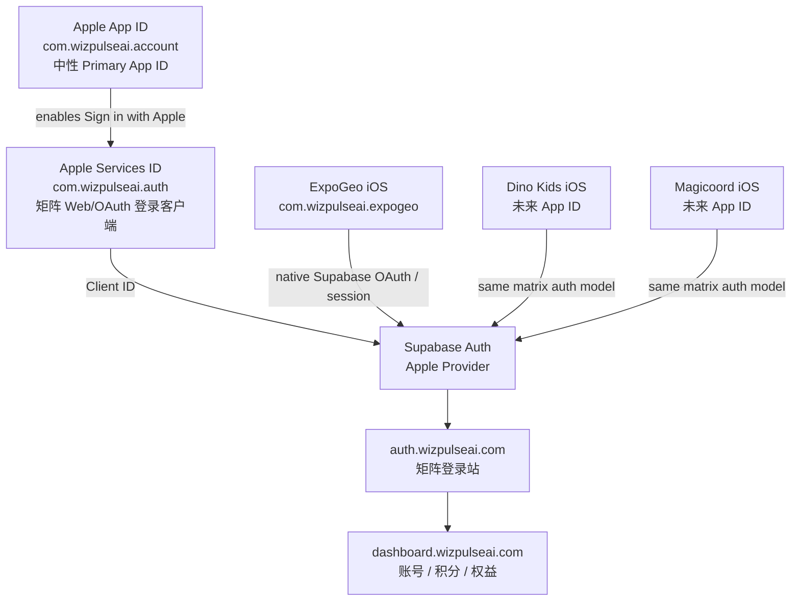

# Apple Sign in with Apple ID 关系指南

Last updated: 2026-05-19

这份文档记录 WizPulseAI 矩阵账号、Apple Developer Identifiers、Supabase Apple Provider、各个 iOS App 之间的关系。

## 当前推荐结构



## Identifier 职责

| Identifier | 类型 | 职责 |
| --- | --- | --- |
| `com.wizpulseai.account` | App ID | Apple 侧中性 Primary App ID，只作为 Sign in with Apple 能力的 anchor。 |
| `com.wizpulseai.auth` | Services ID | 矩阵账号系统的 Web/OAuth Client ID，配置到 Supabase Apple Provider。 |
| `com.wizpulseai.expogeo` | App ID / Bundle ID | ExpoGeo iOS App 本体。 |
| `com.wizpulseai.dinokids` | App ID / Bundle ID | Dino Kids iOS App 本体，未来创建。 |
| `com.wizpulseai.magicoord` | App ID / Bundle ID | Magicoord iOS App 本体，未来创建。 |

## 为什么 Primary App ID 用 account

Apple 的 Services ID 不能完全独立存在。用于 Web/OAuth 的 Services ID 必须关联一个启用了 Sign in with Apple 的 Primary App ID。

如果把 `com.wizpulseai.auth` 挂在 `com.wizpulseai.expogeo` 下面，技术上可以工作，但语义上会让矩阵账号系统看起来依赖 ExpoGeo。中长期更清晰的做法是：

```text
Primary App ID: com.wizpulseai.account
Services ID:    com.wizpulseai.auth
```

这样 Apple 侧的登录能力归属于矩阵账号系统，而不是某个具体产品。

## Supabase Apple Provider 推荐配置

Client IDs:

```text
com.wizpulseai.auth
```

Callback URL 使用 Supabase 后台显示的项目 URL：

```text
https://<supabase-project-ref>.supabase.co/auth/v1/callback
```

Apple Developer 的 Services ID 里也要填写同一个 callback URL，并配置矩阵登录域名：

```text
auth.wizpulseai.com
```

如果本地测试或迁移期间仍保留旧的 ExpoGeo Services ID，可以临时把多个 Client IDs 放进 Supabase：

```text
com.wizpulseai.auth,com.wizpulseai.expogeo.auth
```

迁移完成后，保留 `com.wizpulseai.auth` 即可。

## 是否需要 Geo 专用 Services ID

不需要作为长期标准。

ExpoGeo iOS 是一个矩阵 App，它应该使用同一个 Supabase Auth 项目和同一个矩阵账号体系。Geo 本体只需要自己的 iOS Bundle ID：

```text
com.wizpulseai.expogeo
```

Geo 不需要长期持有单独的：

```text
com.wizpulseai.expogeo.auth
```

只有在早期测试、迁移或排障时，才有必要临时保留 App 专用 Services ID。

## 旧 Services ID 是否可以删除

可以删除，但建议按顺序做：

1. 先确认 `com.wizpulseai.auth` 在 Apple Developer 中已启用并关联到 `com.wizpulseai.account`。
2. 确认 Supabase Apple Provider 的 Client IDs 已更新为 `com.wizpulseai.auth`。
3. 确认 Apple Developer Services ID 的 callback URL 是 Supabase callback URL。
4. 用矩阵 auth web 登录和 ExpoGeo iOS Apple 登录各测一次。
5. 测试通过后，再删除旧的 `com.wizpulseai.expogeo.auth`。

删除旧 Services ID 之前，不要把 Supabase Client IDs 里的旧值提前移除，否则还在使用旧 client id 的测试包会出现 `invalid_request` 或 `invalid_client`。

## 与 App Store 收费规则的关系

这套命名和绑定关系不会决定 Apple 是否要求 IAP。App Store 审核重点仍然是 iOS App 内的行为：

允许：

```text
登录
读取已有权益
显示余额
消耗 web 已购买的 points
demo mode
删除账号
```

不要在 iOS App 内出现：

```text
购买 / 充值 / 升级按钮
跳转官网付费链接
二维码购买入口
web 更便宜等文案
客服自动引导去官网购买
隐藏购买入口或远程审核欺骗
```

## 最终目标

```text
Apple Primary App ID: com.wizpulseai.account
Apple Services ID:    com.wizpulseai.auth
Supabase Client ID:   com.wizpulseai.auth
Web Auth Site:        auth.wizpulseai.com
iOS App Bundle IDs:   每个产品各自独立
Payment / Stripe:     只在 Dashboard / Web 中央系统处理
```
