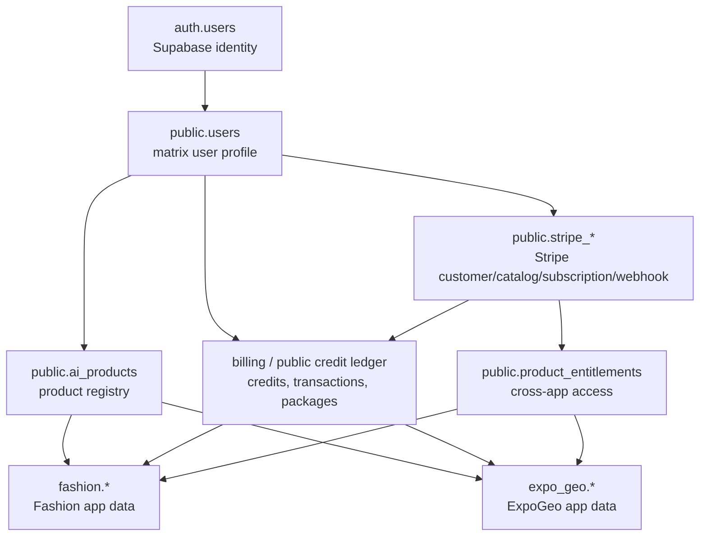

# WizPulseAI Matrix Database Architecture Review

Date: 2026-05-15

Scope:
- Matrix account and registration data.
- Stripe, credits, subscription, webhook, and entitlement data.
- Product-app specific data, including the future ExpoGeo integration.
- Remote database structure was inspected in read-focused mode. The only schema mutation already applied before this document was the Stripe webhook/credit idempotency hardening migration.

Non-goals:
- This document does not redesign any product UI.
- This document does not move data between schemas yet.
- This document does not make ExpoGeo own Stripe billing.

## Executive Summary

The current database has the right core ingredients, but they are not cleanly separated yet:

1. Supabase `auth.users` is the identity source of truth.
2. Matrix profile and Stripe customer mapping live in `public.users`.
3. Product registry exists in `public.ai_products`.
4. Stripe catalog tables have already been renamed to `public.stripe_products` and `public.stripe_prices`.
5. Real point-buyout credits are currently stored in `fashion.user_credits` and `fashion.credit_transactions`.
6. Subscription and feature entitlement code is still partially wired to removed legacy tables: `products`, `prices`, `features`, `plan_features`, and `usage_records`.
7. ExpoGeo does not have its own database schema or product registry row yet.

Recommended immediate direction:

- Keep subscriptions disabled until old table references are removed or rewritten.
- Keep point-buyout credits as the production billing path.
- Treat `fashion.user_credits` and `fashion.credit_transactions` as the current live credit ledger, even though the schema name is too product-specific.
- Add a neutral entitlement layer before connecting ExpoGeo to paid access.
- Do not use `supabase db push` until local and remote migration history divergence is repaired.

## Current Remote Database Shape

### Supabase-Owned Schemas

- `auth`: Supabase identity, sessions, identities, MFA, SSO internals.
- `storage`: Supabase storage buckets and objects.
- `realtime`, `graphql`, `graphql_public`, `vault`, `extensions`: Supabase platform support.
- `supabase_migrations`: remote migration history.

These should be treated as platform schemas. Application business data should not be added to `auth`.

### Matrix/Public Tables

Observed tables in `public`:

- `users`
- `ai_products`
- `stripe_products`
- `stripe_prices`
- `subscriptions`
- `webhook_events`
- `audit_logs`
- `ip_rate_limit_usage`
- `site_config`
- `config_history`
- `community_profiles`
- `community_posts`
- `community_likes`
- `referral_records`
- `share_records`
- `share_reward_config`

Important observed row counts:

- `public.users`: 13
- `public.ai_products`: 4
- `public.stripe_products`: 1
- `public.stripe_prices`: 1
- `public.subscriptions`: 0
- `public.webhook_events`: 4

### Fashion / Current Credit Tables

Observed tables in `fashion`:

- `user_credits`
- `credit_transactions`
- `credit_packages`
- `user_profiles`
- `photos`
- `analyses`
- `generated_outfits`
- `personalization_options`
- `storage_quotas`
- `chat_sessions`
- `chat_messages`

Important observed row counts:

- `fashion.user_credits`: 13
- `fashion.credit_transactions`: 22
- `fashion.credit_packages`: 3
- `fashion.photos`: 5
- `fashion.analyses`: 6
- `fashion.generated_outfits`: 5
- `fashion.user_profiles`: 2
- `fashion.personalization_options`: 12

### Product Registry

`public.ai_products` currently contains these product codes:

- `magicoord`: active beta, credit billing, product URL points to MagicCoord/Fashion product.
- `quickslide`: inactive, credit billing.
- `codespark`: inactive.
- `chatbot`: inactive.

ExpoGeo is not registered yet.

### Stripe Catalog

`public.stripe_products` and `public.stripe_prices` exist and appear to be the post-renaming catalog tables.

Observed data currently looks more like test or legacy subscription catalog data than production point-buyout package data:

- One QuickSlide product.
- One monthly JPY recurring price.
- No active rows in `public.subscriptions`.

This reinforces that subscriptions are not the production mainline right now.

### Credit Package Source of Truth Drift

There is a mismatch between database package rows and code package rows:

- `fashion.credit_packages` contains older packages such as 50 credits for JPY 490, 100 + 10 bonus for JPY 980, and 300 + 50 bonus for JPY 2480.
- The current dashboard code uses hardcoded package definitions in `db-wizPulseAI-com/src/lib/credits/packages.ts`.
- Observed successful purchase transaction matches the code-side package model, not the old database package table.

Short-term interpretation:

- Code package definitions are the current production source of truth.
- `fashion.credit_packages` is stale unless intentionally reactivated.

Medium-term direction:

- Move package definitions into a neutral billing table only after the checkout and webhook code are migrated to read that table consistently.

## Current Code / Database Drift

The database has moved beyond the legacy billing schema, but parts of the dashboard code still reference removed or renamed tables.

High-risk legacy references include:

- `products`
- `prices`
- `features`
- `plan_features`
- `usage_records`

Known affected areas in `db-wizPulseAI-com`:

- Subscription checkout still queries legacy `prices` and nested `products`.
- Stripe webhook subscription/product/price handlers still contain old catalog assumptions.
- Admin product, price, feature, and plan-feature APIs still use legacy table names.
- Feature access and usage APIs still rely on `features`, `plan_features`, and `usage_records`.
- Billing dashboard code has mixed assumptions: some paths use old `products`, while other paths already use `stripe_prices` joined to `stripe_products`.

Practical meaning:

- Point-buyout credit checkout can be kept alive.
- Subscription and entitlement functionality should stay disabled until these paths are cleaned.
- Admin billing pages should not be trusted as production controls until they are aligned with the actual schema.

## Recommended Target Architecture

### Layering

The naming above shows target ownership. It does not require an immediate migration to a new `billing` schema; that can be phased later.

### Identity and Registration

Source of truth:

- `auth.users`: Supabase-managed identity.

Matrix user profile:

- `public.users`: one row per auth user.
- Stores app-level user status, role, preferred language, Stripe customer id, current matrix tier, and timestamps.
- Should be created by a controlled auth callback, trigger, or server-side upsert.

Rules:

- Product apps should not write directly to `auth.users`.
- Product apps should not duplicate user identity tables.
- Product apps should call matrix auth/session APIs or use Supabase session identity and join through `public.users`.

Recommended fields for `public.users`:

- `id`: same UUID as `auth.users.id`.
- `email`: convenience mirror, not the auth source of truth.
- `display_name` / `avatar_url`: optional profile mirrors.
- `app_role`: user/admin/system role.
- `status`: active/suspended/deleted.
- `preferred_language`.
- `stripe_customer_id`.
- `matrix_subscription_tier`: free/pro/etc, if subscriptions are later restored.
- `created_at`, `updated_at`, `last_login_at`.

### Product Registry

Source of truth:

- `public.ai_products`.

Purpose:

- Register every matrix app.
- Store product code, brand, public URL, active/beta status, billing model, and lightweight quota metadata.

Recommended product codes:

- `magicoord` or `fashion`
- `expo_geo`
- `quickslide`
- `codespark`
- `chatbot`

Recommended rules:

- Every app integration starts by adding an `ai_products` row.
- App-specific schemas reference product code when they need product-level behavior.
- Billing and entitlement logic should use product codes rather than hostnames.

ExpoGeo should first be added here before paid access is enforced.

### Stripe and Billing

Current production mainline:

- Point buyout / credits.

Current non-mainline:

- Subscriptions.

Recommended Stripe ownership:

- Only matrix billing/dashboard owns Stripe customer creation, checkout sessions, portal sessions, webhooks, and reconciliation.
- Product apps do not create Stripe checkout sessions directly.
- ExpoGeo must call matrix entitlement/credit APIs instead of owning Stripe.

Recommended shared Stripe tables:

- `public.stripe_products`: Stripe product catalog mirror.
- `public.stripe_prices`: Stripe price catalog mirror.
- `public.subscriptions`: user subscription state, when subscription is restored.
- `public.webhook_events`: idempotency, audit, failure tracking.
- `public.users.stripe_customer_id`: user-to-customer mapping.

Rules:

- Webhook handlers must be idempotent by Stripe event id and site source.
- Credit grants must be idempotent by Stripe checkout session id and payment intent id.
- Checkout fulfillment must verify amount, currency, package id, user id, and payment status.
- Subscription routes should remain behind `ENABLE_SUBSCRIPTIONS` until table naming and entitlement logic are repaired.

### Credits

Current live tables:

- `fashion.user_credits`
- `fashion.credit_transactions`

Current issue:

- These are named as Fashion tables but are already acting like shared matrix credit tables.

Recommended phased approach:

Phase 1, no data move:

- Keep the existing `fashion` credit tables.
- Explicitly document them as the current shared credit ledger.
- Add product/app metadata to credit transactions when needed.
- Keep checkout and webhook paths stable.

Phase 2, neutralize naming:

- Introduce `billing.user_credits` and `billing.credit_transactions`, or neutral `public.user_credits` and `public.credit_transactions`.
- Backfill from `fashion`.
- Create compatibility views or adapter functions for the old `fashion` paths.
- Move code reads/writes in one controlled migration.

Phase 3, package source of truth:

- Replace hardcoded package definitions with a neutral `credit_packages` table only when admin/package management is ready.
- Include `product_code`, `stripe_price_id`, `currency`, `amount`, `credits`, `bonus_credits`, `active`, `sort_order`, and metadata.

### Entitlements

The previous feature entitlement layer is incomplete because old tables are missing or renamed.

Recommended new minimal entitlement layer:

- `public.product_entitlements`
- Optional `public.product_feature_definitions`
- Optional `public.usage_events` / `public.usage_counters` if monthly quotas are needed.

Recommended `product_entitlements` fields:

- `id`
- `user_id`
- `product_code`
- `feature_code`
- `source_type`: subscription, credit_purchase, admin_grant, trial, promo.
- `source_id`: Stripe subscription id, transaction id, grant id, etc.
- `status`: active, expired, revoked, pending.
- `starts_at`
- `ends_at`
- `metadata`
- `created_at`, `updated_at`

ExpoGeo should consume this layer for app access decisions. It should not infer access from Stripe tables directly.

### App-Specific Schemas

Rule:

- Shared account, billing, Stripe, entitlement, and product registry tables stay in matrix-owned schemas.
- Product-specific content and behavior tables stay in product-owned schemas.

Existing:

- `fashion.*` owns fashion-specific photos, analyses, generated outfits, user styling preferences, and chat data.

Recommended for ExpoGeo:

- Create `expo_geo` schema, or `geo` if a shorter stable product code is preferred.
- Keep learning data app-specific.
- Reference matrix user id from `auth.users` / `public.users`.

Candidate ExpoGeo tables:

- `expo_geo.user_profiles`: learning settings, preferred language, region, age mode if needed.
- `expo_geo.country_progress`: per-country completion and mastery state.
- `expo_geo.quiz_attempts`: quiz runs, score, mode, duration.
- `expo_geo.quiz_answers`: optional normalized answer detail.
- `expo_geo.favorite_countries`: saved countries.
- `expo_geo.learning_events`: append-only activity events.
- `expo_geo.content_packs`: optional app content packs, if content becomes database-managed.

ExpoGeo paid checks:

- `expo_geo` tables store learning state.
- `public.product_entitlements` says whether the user can access paid packs/features.
- Credit spend, if any, is recorded in the shared credit ledger.
- Stripe remains in matrix billing.

## Migration History Risk

Remote and local Supabase migration history are not aligned.

Observed practical impact:

- `supabase db push` is unsafe right now because the CLI sees migration divergence.
- Applying all local migrations blindly could re-run old assumptions and damage the remote schema.

Recommended repair path:

1. Do not use `supabase db push` for production until repaired.
2. Create a fresh schema dump from remote as the actual baseline.
3. Compare local migrations against remote `supabase_migrations.schema_migrations`.
4. Decide whether to:
   - repair migration history with Supabase migration repair commands, or
   - create a new squashed baseline migration and archive old drifted migrations.
5. Only then resume normal migration workflow.

## Immediate Risk Register

P0 / blocking before subscriptions:

- Subscription APIs reference legacy tables that no longer match remote schema.
- Feature entitlement APIs reference missing legacy entitlement tables.
- Admin billing controls are not reliable production controls.

P1 / blocking before ExpoGeo paid launch:

- ExpoGeo is not in `public.ai_products`.
- There is no clean cross-app entitlement table.
- Shared credit ledger is still in `fashion` schema.
- Package source of truth is split between stale DB rows and current code constants.

P2 / cleanup:

- Some data names still imply Fashion-only ownership even when used as matrix billing.
- Stripe catalog rows appear test/legacy and should be reconciled with real Stripe products/prices before subscriptions are restored.
- Remote migration history needs a formal baseline.

## Recommended Next Steps

### Step 1: Freeze Subscription Surface

- Keep `ENABLE_SUBSCRIPTIONS=false`.
- Hide or disable admin routes/pages that mutate old product/price/feature tables.
- Make code fail closed for subscription checkout, cancel, reactivate, portal, feature usage, and entitlement APIs.

### Step 2: Align Code With Actual Tables

- Replace remaining `products` / `prices` reads with `stripe_products` / `stripe_prices`, or remove those code paths from active routing.
- Remove or quarantine `features`, `plan_features`, and `usage_records` dependent paths.
- Add focused tests for feature-gated endpoints to prove disabled mode fails closed.

### Step 3: Define Minimal Entitlement Schema

- Add `public.product_entitlements`.
- Add a small server API: "does user have access to product/feature?"
- Make this API the only interface product apps need.

### Step 4: Prepare ExpoGeo

- Add `expo_geo` product row to `public.ai_products`.
- Add `expo_geo` schema and app-specific progress tables.
- Wire ExpoGeo auth to matrix session/user id.
- Wire ExpoGeo paid access to matrix entitlement API.
- Do not add Stripe to ExpoGeo.

### Step 5: Normalize Credits

- Decide whether to keep `fashion` credit tables long-term with documentation, or migrate to neutral billing tables.
- If migrating, use compatibility views/functions and a phased rollout.
- Reconcile `fashion.credit_packages` with code-defined packages before making package management dynamic.

## Working Principle

The matrix database should have one shared account and billing core, plus separate app-owned schemas.

Short-term production-safe shape:

- Identity: `auth.users` + `public.users`
- Product registry: `public.ai_products`
- Stripe/webhook: `public.stripe_*`, `public.subscriptions`, `public.webhook_events`
- Credits: existing `fashion.user_credits`, `fashion.credit_transactions`
- App data: `fashion.*`, future `expo_geo.*`

Target shape:

- Identity remains Supabase + matrix profile.
- Billing/credits move to neutral matrix-owned naming.
- Entitlements become explicit and product-code based.
- Product apps only own their domain data and call matrix APIs for access/payment state.
