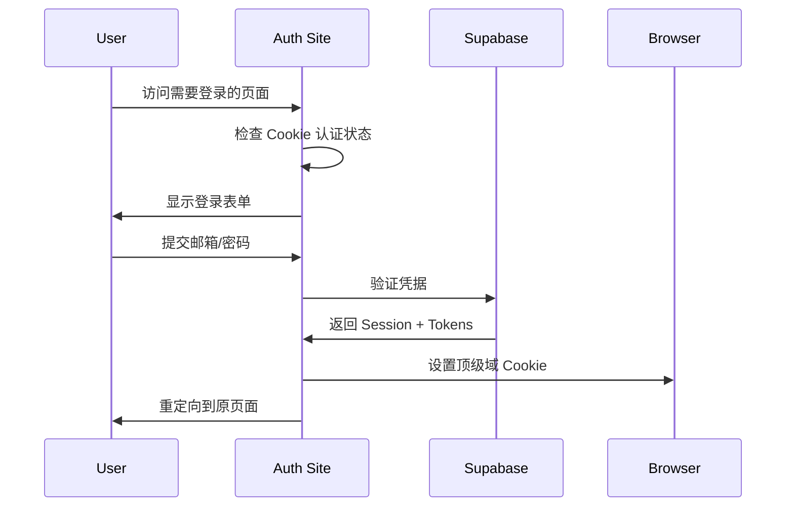
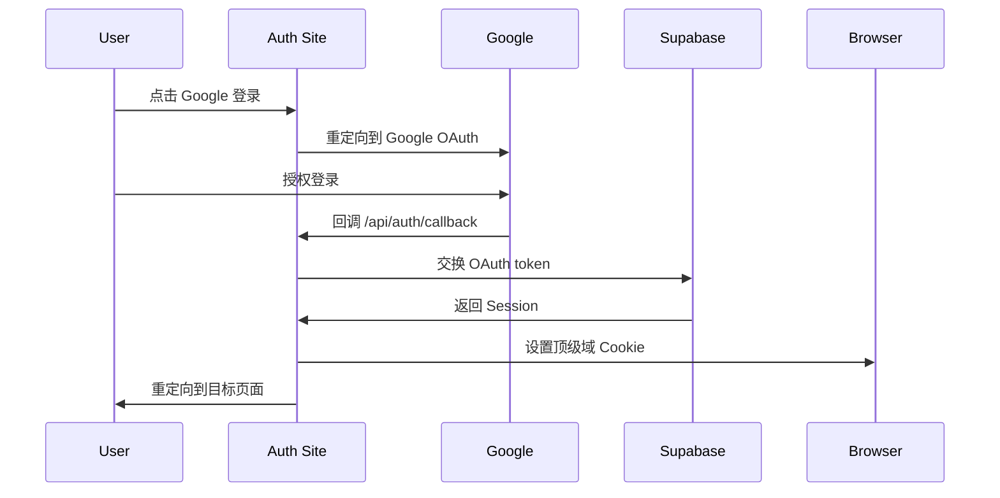
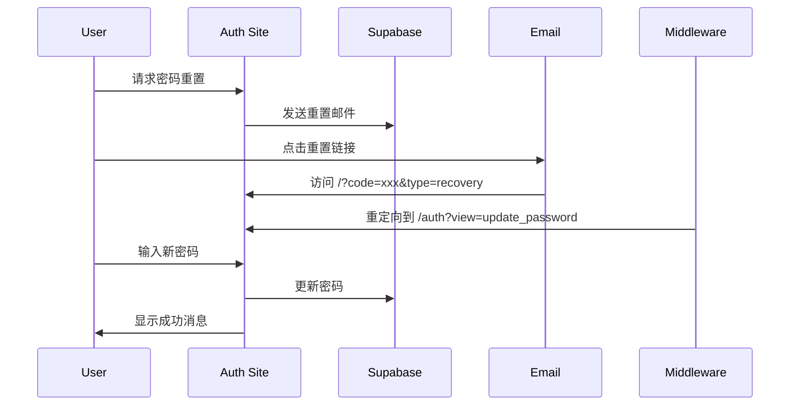

# Auth站点技术架构文档

## 文档信息
- **版本**: v1.0
- **作者**: WizPulseAI Tech Team
- **创建日期**: 2025-01-29
- **最后更新**: 2025-01-29
- **状态**: 已发布

## 概述
本文档详细描述了 auth.wizpulseai.com 的技术架构，包括核心组件、认证流程、安全机制和扩展方案。Auth站点是整个 WizPulseAI 生态系统的认证中心，负责处理所有子域的用户认证需求。

## 目录
- [核心概念](#核心概念)
- [技术架构](#技术架构)
- [认证流程](#认证流程)
- [Cookie机制](#cookie机制)
- [安全设计](#安全设计)
- [扩展方案](#扩展方案)
- [注意事项](#注意事项)

## 核心概念

### 1. SSO (Single Sign-On) 单点登录
- 用户在 auth.wizpulseai.com 登录一次
- 所有 *.wizpulseai.com 子域自动获得认证状态
- 通过顶级域 Cookie 实现状态共享

### 2. 多语言支持
- 支持语言: ja (日语), zh (中文), en (英语)
- 默认语言: ja
- 通过 URL 参数 `lang` 和 Cookie `NEXT_LOCALE` 控制

### 3. 认证方式
- 邮箱/密码认证
- Google OAuth 2.0
- 密码重置流程（邮件链接）

## 技术架构

### 技术栈
```yaml
框架: Next.js 14.2.28 (App Router)
认证: Supabase Auth
UI: @supabase/auth-ui-react + 自定义包装
样式: Tailwind CSS + shadcn/ui
语言: TypeScript
部署: Vercel
```

### 核心文件结构
```
auth-wizpulseai-com/
├── src/
│   ├── app/
│   │   ├── (auth)/
│   │   │   └── auth/
│   │   │       ├── page.tsx          # 主认证页面
│   │   │       └── v1/
│   │   │           └── logout/
│   │   │               └── route.ts  # 登出API
│   │   └── api/
│   │       └── auth/
│   │           └── callback/
│   │               └── route.ts      # OAuth回调
│   ├── components/
│   │   └── CustomAuthUI.tsx          # Supabase UI包装器
│   ├── lib/
│   │   ├── supabase-browser.ts      # 浏览器端客户端
│   │   ├── supabase-server.ts       # 服务器端客户端
│   │   └── utils/
│   │       └── redirect.ts           # 安全重定向工具
│   └── middleware.ts                 # 请求中间件
```

### 关键组件说明

#### 1. CustomAuthUI 组件
```typescript
// 核心功能：
// - 包装 Supabase Auth UI
// - 拦截和本地化错误消息
// - 处理多语言显示
// - 使用 MutationObserver 监听 DOM 变化

特性：
- 自动检测语言设置
- 错误消息本地化映射
- 区分"邮箱已注册"和"已关联OAuth"
```

#### 2. Supabase 客户端配置
```typescript
// Browser Client
- Cookie 选项：自动处理 __Host- 和 __Secure- 前缀
- 支持顶级域 Cookie 设置
- 自动 token 刷新

// Server Client  
- 基于 @supabase/ssr
- 读取请求中的 Cookie
- 服务端渲染支持
```

#### 3. 中间件处理
```typescript
// middleware.ts
- 处理密码重置回调 (/?code=xxx&type=recovery)
- 自动重定向到 /auth 页面
- 保留语言参数
- 添加必要的查询参数
```

## 认证流程

### 1. 登录流程


### 2. OAuth 流程


### 3. 密码重置流程


## Cookie机制（统一到共享文档策略）

### Cookie 配置
为减少分歧，Cookie 选项统一参见 `technical-docs/00-shared/01-ARCH-SSO与Cookie鉴权-v1.0.md`。

要点（与代码实现保持一致）：
- 生产：`domain=.wizpulseai.com; path=/; Secure; SameSite=None; HttpOnly`
- 开发：使用伪顶级域（如 `.local.wiz`）+ `SameSite=Lax` 或按需 `None+Secure`
- 使用 `@supabase/ssr` 在服务端写入/刷新 Cookie，优先 SSR 读取会话，前端不直接持有 token

### Cookie 类型
1. **sb-access-token**: JWT 访问令牌
2. **sb-refresh-token**: 刷新令牌
3. **NEXT_LOCALE**: 语言偏好设置

### Cookie 安全前缀
- **__Host-**: 必须 Secure + Path=/ + 无 Domain
- **__Secure-**: 必须 Secure (HTTPS)
- Auth 站点支持自动检测和处理这些前缀

## 安全设计

### 1. 开放重定向防护
```typescript
// lib/utils/redirect.ts
- 验证重定向 URL 的域名
- 只允许 *.wizpulseai.com 域名
- 防止恶意重定向攻击
```

### 2. CSRF 防护
- Supabase 自带 CSRF 保护
- 使用 secure cookies
- SameSite 属性设置

### 3. 会话安全
- JWT 自动过期和刷新（由 SSR 客户端与 Supabase 处理）
- HttpOnly Cookie（服务端优先），减少 XSS 风险
- Secure 标志（生产环境）

### 4. 错误处理
- 不暴露敏感信息
- 统一错误消息格式
- 本地化错误提示

## 扩展方案

### 1. 添加新的认证方式
```typescript
// 在 CustomAuthUI 中添加新的 provider
providers: ['google', 'github', 'apple']  // 示例

// 配置新的 OAuth 回调
// 在 Supabase Dashboard 中设置
```

### 2. 增加新的语言支持
```typescript
// 1. 更新语言常量
const LANGUAGES = ['ja', 'zh', 'en', 'ko'] // 添加韩语

// 2. 添加错误消息映射
const errorMessages = {
  ko: {
    'User already registered': '이미 등록된 사용자입니다',
    // ...
  }
}

// 3. 更新 UI 文本翻译
```

### 3. 自定义认证 UI
```typescript
// 替换 CustomAuthUI 组件
// 实现自己的表单和样式
// 保持与 Supabase Auth 的集成
```

### 4. 添加 MFA (多因素认证)
```typescript
// Supabase 支持 TOTP
// 需要更新认证流程
// 添加 MFA 设置页面
```

### 5. 企业 SSO 集成
```typescript
// SAML 2.0 支持
// 需要 Supabase 企业版
// 或实现自定义 SAML 处理
```

## 注意事项

### 1. 不要修改的部分
- Cookie 域配置（会破坏 SSO）
- 基础认证流程（其他站点依赖）
- URL 参数格式（已被其他站点使用）

### 2. 已知问题
- 邮箱确认双页面问题（新标签页 + 原页面都会登录）
- 混用新旧 Supabase 包（需要统一到 `@supabase/ssr`）
- Bundle size 较大（Auth UI 库体积）

### 参考共享文档
- `technical-docs/00-shared/00-ARCH-三站点架构总览-v1.0.md`
- `technical-docs/00-shared/01-ARCH-SSO与Cookie鉴权-v1.0.md`

### 3. 性能考虑
- Auth UI 首次加载: ~66KB
- 可考虑按需加载或代码分割
- 缓存静态资源

### 4. 监控要点
- 登录成功率
- OAuth 回调失败率
- 密码重置完成率
- Cookie 设置失败情况

### 5. 部署注意
- 环境变量必须完整配置
- Vercel 部署需要设置正确的域名
- CORS 设置要包含所有子域

## 多子站点扩展与统一账户管理
- 目标：未来支持多个小型 Web App 接入同一账户体系（统一登录、角色、订阅与配额）。
- 角色与权限：
  - 继续使用 `app_role` 作为基础权限（admin/user/deleted）。
  - 细粒度能力建议通过 DB 的 `features`、`plan_features`、`usage_records` 扩展，避免在站点内硬编码。
- 新站点接入要求：
  - 使用 `@supabase/ssr` 的服务端客户端，在 SSR/Route Handler 读取会话。
  - 通过 `auth.wizpulseai.com` 完成登录；auth 写入顶级域 Cookie 后重定向回新站点。
  - 按共享文档配置 Cookie 策略与 CSP。
- 运维与配置：
  - Vercel 创建独立项目/环境变量；与主项目共享 Supabase URL/Anon Key 与 Cookie Domain。
  - 如需默认落点，配置 `NEXT_PUBLIC_DEFAULT_REDIRECT_URL` 指回新站。
- 参考：
  - `technical-docs/00-shared/00-ARCH-三站点架构总览-v1.0.md`
  - `technical-docs/00-shared/01-ARCH-SSO与Cookie鉴权-v1.0.md`
  - `technical-docs/00-shared/01-GUIDE-子站点接入指南-v1.0.md`

## 更新记录
- 2025-01-29: v1.0 初始版本，基于现有代码分析编写

---

## 附录：关键代码片段

### Cookie 设置示例
```typescript
// 设置顶级域 Cookie
response.cookies.set({
  name: 'auth-token',
  value: token,
  domain: '.wizpulseai.com',
  path: '/',
  secure: true,
  sameSite: 'lax',
  maxAge: 60 * 60 * 24 * 30 // 30天
})
```

### 安全重定向示例
```typescript
import { isValidRedirectUrl } from '@/lib/utils/redirect'

const redirectTo = searchParams.get('redirect_to')
if (redirectTo && isValidRedirectUrl(redirectTo)) {
  return redirect(redirectTo)
}
```

### 语言检测示例
```typescript
const lang = searchParams.get('lang') || 
             cookies().get('NEXT_LOCALE')?.value || 
             'ja'
```
