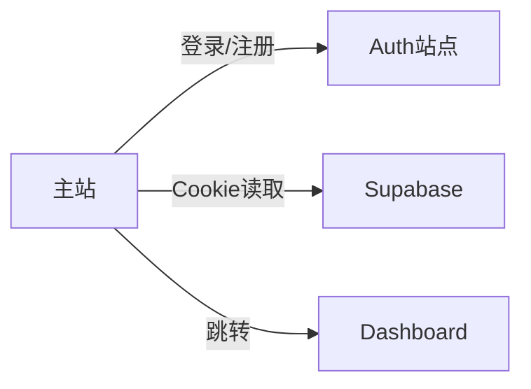

# 主站技术架构与用户功能分析

## 文档信息
- **版本**: v1.0
- **作者**: WizPulseAI Tech Team
- **创建日期**: 2025-01-30
- **最后更新**: 2025-01-30
- **状态**: 已发布

## 概述
本文档重点分析 www.wizpulseai.com 主站的技术架构，特别是用户相关功能的实现，以及与其他站点的集成方式。

## 用户功能实现分析

### 1. UserMenu 组件详解

#### 核心功能
`UserMenu.tsx` 是主站用户交互的核心组件，提供：
- 用户状态显示（头像、邮箱）
- 登录/注册入口
- Dashboard 跳转
- 登出功能
- 使用量显示（仅 App 站点）

#### 技术实现特点
```typescript
// 1. 认证状态获取
const { session, isLoading, isAuthenticated, logout } = useAuth()

// 2. 环境变量依赖
const dashboardDirectUrl = process.env.NEXT_PUBLIC_DASHBOARD_APP_URL
const authServiceBaseUrl = process.env.NEXT_PUBLIC_AUTH_URL

// 3. 安全重定向
const safeRedirectUrl = isAllowedRedirect(redirectUrl) 
  ? redirectUrl 
  : window.location.origin
```

#### 问题点
1. **硬编码的端口号**：开发环境假设 dashboard 在 3001，auth 在 4001
2. **直接的 window.location.href 跳转**：没有使用 Next.js 的导航
3. **Avatar 图片处理**：使用 `unoptimized` 处理 data: URL

### 2. 认证集成方式

#### 与 Auth 站点的交互
```typescript
// 登录 URL 构建
`${authServiceBaseUrl}/auth?view=sign_in&redirect_to=${encodeURIComponent(safeRedirectUrl)}&lang=${currentLocale}`

// 注册 URL 构建
`${authServiceBaseUrl}/auth?view=sign_up&redirect_to=${encodeURIComponent(safeRedirectUrl)}&lang=${currentLocale}`
```

**特点**：
- 完全依赖外部认证站点
- 通过 URL 参数传递状态
- 语言参数必须手动传递

#### 共享的 useAuth Hook
主站复用了与 Dashboard 相同的认证逻辑：
```typescript
// shared/auth/useAuth.tsx
- 监听 Supabase auth 状态变化
- 管理 session 状态
- 提供统一的 logout 函数
```

### 3. 用户状态展示

#### 头像显示逻辑
```typescript
// 优先级：
1. user.user_metadata?.avatar_url (Google OAuth 头像)
2. 邮箱首字母作为默认头像
```

#### 在线状态指示
```html
<!-- 绿色小圆点表示在线 -->
<span className="absolute bottom-0 right-0 block h-2 w-2 rounded-full bg-green-500"></span>
```

### 4. Dashboard 集成

#### 直接跳转方式
```typescript
window.location.href = dashboardDirectUrl; // 硬跳转到 Dashboard
```

**问题**：
- 没有检查用户是否有 Dashboard 访问权限
- 没有传递任何上下文信息
- 可能导致页面闪烁

## 主站整体架构

### 1. 技术栈概览
- **框架**: Next.js 14 (App Router)
- **国际化**: next-intl ([locale] 动态路由)
- **UI**: Tailwind CSS + Headless UI + shadcn/ui
- **3D/动画**: Three.js + Framer Motion
- **状态管理**: 主要使用 React State

### 2. 路由结构
```
app/
├── [locale]/           # 国际化路由
│   ├── page.tsx       # 首页
│   ├── products/      # 产品展示
│   ├── knowledge-hub/ # 知识中心
│   ├── about/         # 关于我们
│   └── contact/       # 联系我们
├── api/               # API 路由
└── auth/              # 认证相关（重定向）
```

### 3. 非用户功能概述

#### 产品展示系统
- 5个 AI 产品页面
- 产品详情和定价信息
- "Try" 入口（未实现）

#### 知识中心
- 文章分类系统
- Markdown 内容渲染
- 相关内容推荐

#### 3D 动画
- Three.js 背景效果
- Framer Motion 页面转场
- GSAP 滚动动画

## 与其他站点的配合分析

### 1. 认证依赖


**依赖程度**: 高度依赖 Auth 站点

### 2. 数据共享
- **共享内容**: Cookie (认证状态)
- **不共享**: 用户详细信息、使用数据
- **需要改进**: 缺少用户 Profile 数据

### 3. 导航流程
```
用户点击登录 → 跳转到 Auth → 登录成功 → 返回主站 → 显示用户菜单
用户点击 Dashboard → 直接跳转 → Dashboard 检查认证
```

## 技术债务分析

### 1. 用户体验问题
- **页面跳转**：使用 window.location.href 导致全页刷新
- **加载状态**：认证检查时的闪烁
- **错误处理**：登出失败时的用户反馈不足

### 2. 代码质量问题
- **环境变量散落**：多处硬编码 URL
- **类型安全**：user_metadata 没有类型定义
- **组件复杂度**：UserMenu 组件过于庞大

### 3. 性能问题
- **重复的认证检查**：每个页面都会检查
- **图片优化**：Avatar 图片未优化
- **Bundle Size**：Three.js 等库的体积

### 4. 扩展性问题
- **紧耦合**：与 Auth/Dashboard 站点紧密耦合
- **配置分散**：没有集中的配置管理
- **测试困难**：需要多站点联调

## 安全考虑

### 1. URL 安全
```typescript
// 使用了 isAllowedRedirect 防止开放重定向
const safeRedirectUrl = isAllowedRedirect(redirectUrl) 
  ? redirectUrl 
  : window.location.origin
```

### 2. 潜在风险
- user_metadata 可被用户修改
- 没有 CSRF 保护（依赖 Cookie）
- 敏感信息可能暴露在 URL 中

## 未来扩展建议

### 1. 用户功能增强
- 添加用户 Profile 页面
- 实现产品试用功能
- 集成使用统计展示

### 2. 技术改进方向
- 使用 Next.js Link 组件替代硬跳转
- 实现用户数据的本地缓存
- 优化认证状态管理

### 3. 新站点集成要点
新站点需要：
1. 复制 shared/auth 目录
2. 配置相同的环境变量
3. 实现 UserMenu 或类似组件
4. 处理语言同步

## 总结

主站的用户功能实现相对简单，主要依赖：
1. **UserMenu 组件**处理所有用户交互
2. **共享的 useAuth Hook**管理认证状态
3. **外部跳转**到 Auth 和 Dashboard 站点

优点：
- 实现简洁，易于理解
- 与其他站点解耦较好
- 安全性基本保障

缺点：
- 用户体验有待改进（页面跳转）
- 缺少本地用户数据管理
- 扩展性受限于当前架构

---
最后更新: 2025-01-30